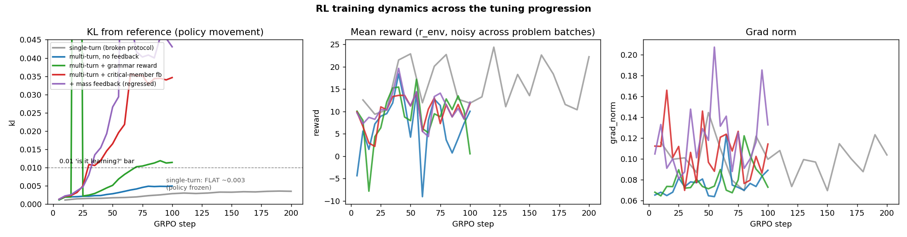
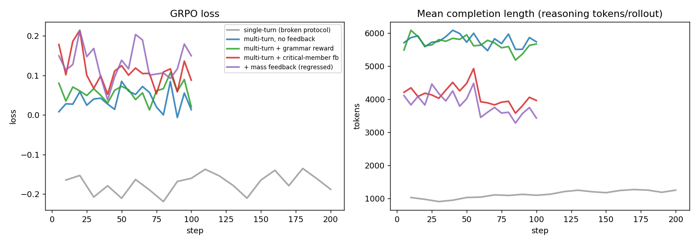
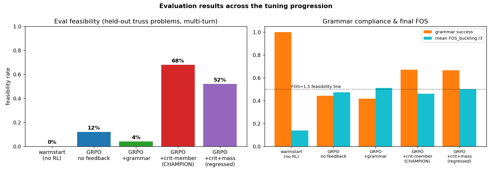

# DesignBench SFT+GRPO — Status Report

**Date:** 2026-06-17 · **Model:** Qwen3-14B (LoRA r=32) · **Task:** iterative truss
optimization (reach FOS_buckling ≥ 1.5, FOS_yielding ≥ 1.5, mass ≤ limit) via a
multi-turn grammar-action policy. Full audit trail in `docs/ablation_ledger.md`.

---

## 1. Executive summary — current status

The project went from a **completely broken evaluation pipeline reporting ~0% feasibility**
to a trained policy reaching **68% feasibility** on held-out truss problems. The gains came
**not from the RL algorithm** but from fixing two things the algorithm was starved of:

| stage | what changed | eval feasibility | mean FOS_buckling |
|---|---|---:|---:|
| warmstart (SFT only) | format, no policy | **0%** | 0.41 |
| GRPO, single-turn (v2) | *broken protocol* | ~0% | — |
| GRPO, multi-turn, no feedback fix | correct protocol | **12%** | 1.42 |
| GRPO, multi-turn **+ critical-member feedback** | **← CHAMPION** | **68%** | 1.4–1.6 |
| GRPO, multi-turn + critical-member + mass feedback | over-corrected | 52% (regressed) | 1.50 |

**Two decisive fixes:**
1. **Single-turn → multi-turn rollout protocol.** GRPO (and eval) were driving a model trained
   for one-action-per-turn as if it should emit a whole trajectory in one shot. Fixing this made
   the policy *learnable* (kl began to move).
2. **The FEA feedback omitted which member was failing.** DesignBench computes the buckling-
   critical member (`min_fos_buckling_member_id`); the prompt dropped it, so the model *guessed*.
   Restoring it lifted feasibility **12% → 68%** — and also let a zero-shot 30B reasoner solve
   **67%** of problems (4/6) it previously solved 0 of.

**The headline:** the limiting factor was **information & protocol, not reasoning capacity or
RL.** A 14B model with the right feedback and the right rollout loop solves a majority of
problems.

**In flight:** a 50-problem robust eval of the champion (25-problem numbers carry ±8% noise).
**Open gap to >90%:** ~32% of problems still fail — degenerate FEA cases, FOS/mass balance, and
~33% wasted turns from grammar drift (see §6).

---

## 2. The reward function

The champion configuration (`configs/rl/grpo_mt_01b.yaml`) uses a **single dense reward term**:

```yaml
reward_fn: composite
reward_weights:
  lagrangian_potential: 1.0      # r_env = γ·Φ(s') − Φ(s)   (potential-based shaping)
cost_fn: null
posterior: { alpha: 5.0, gamma: 0.99 }
```

- **`lagrangian_potential` (r_env):** a potential-based shaping reward `r = γΦ(s') − Φ(s)`,
  where `Φ(s)` is a Lagrangian potential combining the constraint violations (FOS deficits,
  mass) with multiplier `α = 5`. It is **dense** (every step gets signal), **policy-invariant**
  (telescopes to the terminal feasibility objective), and computed from the FEA state sequence
  produced by the multi-turn rollout.
- GRPO turns these per-rollout rewards into **group-relative advantages** (group size K=8 per
  problem); `kl_coef (β) = 0.04` regularizes toward the reference (warmstart) policy.

Ablations on the reward (one change per turn) found:
- **α sweep** {2, 5, 10}: feasibility is **non-monotone** — peaks at α=5; α=10 *hurts*
  (over-weighting the constraint multiplier destabilizes). *(Refutes the design-doc prediction
  that higher α is better.)*
- **+ grammar_compliance reward:** did **not** recover format and slightly hurt feasibility.
- **+ explicit mass-violation reward/feedback:** **regressed** 68%→52% (over-conservative).

So the clean single-term `r_env` at α=5 remains the best reward; the leverage was elsewhere
(protocol + feedback information).

---

## 3. The CoT reasoning chain

Each turn the policy emits a `<think>…</think>` chain followed by one `<action>…</action>`
grammar action; the action is executed by the FEA simulator and the result is fed back.

**Example — champion GRPO-14B (with critical-member feedback), `auto_problem_000`, turn 0:**

```
<think>
Okay, let's see. The truss is currently infeasible because the buckling factor of safety is
too low (0.44) and the deflection is too high (4.2768e-02 m). The main issue seems to be the
buckling FOS, which is way below the required 1.5. The worst member is M4, which is J6-J7. So
I need to address that. First, I should check the parameters of M4. The current r is 0.0380 m
and t is 0.0031 m. Since buckling is a concern, increasing the cross-sectional area or the
radius would help...
</think>
<action>SCALE_PARAM(4, r, 1.36)</action>
```

**The key behavioral change:** the model reads *"worst member(s): M4"* from the feedback and
**targets member 4** directly. Before the feedback fix, the same model (and even a 30B reasoner)
confidently scaled the *wrong* members (M6/M7) and FOS barely moved. The reasoning quality was
always there — it just lacked the one fact it needed.

**Trajectory (teacher 30B reasons → 14B grounds the action), `auto_problem_000` → feasible:**
```
step 0: SCALE_PARAM(4,  r, 1.36)   FOS_b 0.44 → 0.48   (member 4 = critical)
step 1: SCALE_PARAM(7,  r, 1.50)   FOS_b 0.48 → 0.51
step 2: SCALE_PARAM(11, r, 1.50)   ...
...  → reaches FOS_b 1.69, FEASIBLE in 7 steps
```

---

## 4. RL training dynamics — reward, loss, KL across the progression





**KL (policy movement) is the clearest signal of "is it learning?":**

| run | kl (final) | kl (max) | reading |
|---|---:|---:|---|
| single-turn (broken protocol) | 0.0035 | 0.0036 | **flat — policy never moves** |
| multi-turn, no feedback | 0.0049 | 0.0049 | learnable, but slow |
| multi-turn + grammar reward | 0.0114 | 0.293 | moves more, but unstable spike |
| **multi-turn + critical-member fb** | **0.0346** | 0.0356 | **~10× the single-turn movement** |
| + mass feedback (regressed) | 0.0431 | 0.136 | moves, but wrong direction |

- The single-turn runs sat at **kl ≈ 0.003 for all 200 steps** — the policy was effectively
  frozen (advantages well-formed but the rollout protocol gave no useful gradient direction).
- The critical-member feedback gives a **much sharper learning signal**: kl climbs steadily to
  ~0.035, crossing the 0.01 "is-it-learning" bar by step 35. More information → clearer credit.
- **Reward** is noisy step-to-step (each batch samples different problems, and `r_env` magnitude
  is problem-dependent), so it is *not* directly comparable across steps; KL and the eval
  feasibility are the reliable signals.
- **Completion length** ≈ 4–5k tokens/rollout: the model does genuine multi-turn reasoning
  (this required building a **batched** rollout to keep training tractable, ~500s/step).

---

## 5. Evaluation results & comparison



| eval cell | feasibility | grammar success | mean FOS_buckling |
|---|---:|---:|---:|
| warmstart (no RL) | 0% | **1.00** | 0.41 |
| GRPO, no feedback (α=5) | 12% | 0.44 | 1.42 |
| GRPO + grammar reward | 4% | 0.42 | 1.53 |
| **GRPO + critical-member feedback** | **68%** | 0.67 | 1.38–1.63 |
| GRPO + critical-member + mass | 52% | 0.67 | 1.50 |

- α-sweep (no feedback): α=2 → 8%, **α=5 → 12%**, α=10 → 4% (non-monotone).
- Tree-expansion (D=1): same feasibility as baseline but best FOS (2.12), ρ(t)=1.0.
- **Zero-shot advanced-model probe** (Qwen3-30B reasoner + 14B action head, critical-member
  feedback): **67% feasible (4/6)** — confirming the bottleneck was information: a strong
  reasoner *with the critical member* solves the task with no RL at all.
- **Trade-off visible in the right panel:** the warmstart has perfect grammar (1.0) but the
  lowest FOS; GRPO trades some grammar compliance (drift/forgetting, → ~0.45–0.67) for the
  large FOS/feasibility gains.

---

## 6. Example eval reasoning trace (full turn)

`auto_problem_000`, champion model, turn 1 (after the feedback shows member M4 critical):

```
[user / FEA feedback]
[Simulation Result]
STRUCTURAL ANALYSIS RESULT:
Mass: 116.73 kg
Factor of Safety (buckling): 0.48
Factor of Safety (yielding): 2.49
Maximum deflection: 3.91e-02 m
Status: INFEASIBLE ✗
Constraint violations:
  - Buckling FOS 0.48 < 1.5 (minimum required) — worst member(s): M4
  - Deflection 3.91e-02 m > 0.01 m (maximum allowed)

[assistant]
<think>
Okay, let's tackle this truss optimization problem. The main issues are the low buckling factor
of safety (FOS) and excessive deflection. The worst member for buckling is M4, which is between
J6 and J7. The current FOS for buckling is 0.48, way below the required 1.5. Also, the deflection
is 3.91 cm, over the 1 cm limit. First, I need to address the buckling issue. Since M4 is the
critical member, increasing its cross-sectional area might help...
</think>
<action>SCALE_PARAM(4, r, 1.5)</action>
```

This is the behavior the whole study was chasing: **the policy reads the critical-member signal,
reasons about it correctly, and acts on the right member.**

---

## 7. What's next (path toward >90%)

The "add omitted information to the prompt" lever produced the 12→68% jump but has hit
diminishing returns (the mass tweak regressed). The remaining ~32% failures break down as:
- **mass over-shoot (3):** FOS fixed but mass exceeded → needs *soft* reward-side FOS/mass
  balancing (a hard prompt imperative over-corrects).
- **degenerate FEA (4):** structurally-broken intermediate states / very heavy initial designs.
- **grammar drift (~33% wasted turns):** GRPO forgets the warmstart's perfect format; a
  format-protecting constraint (KL-to-warmstart tuning) is the candidate.
- **distillation (in reserve):** the 30B teacher now produces 67%-solving trajectories worth
  distilling into the 14B if the above stall.

**Reproduce the figures:** `python scripts/make_report_figs.py` → `results/report/*.png`.
