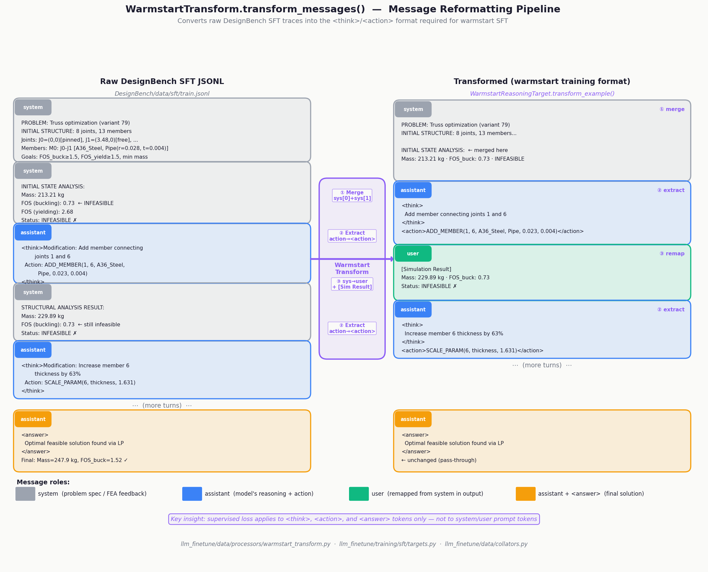
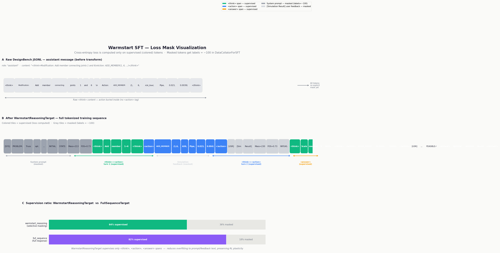
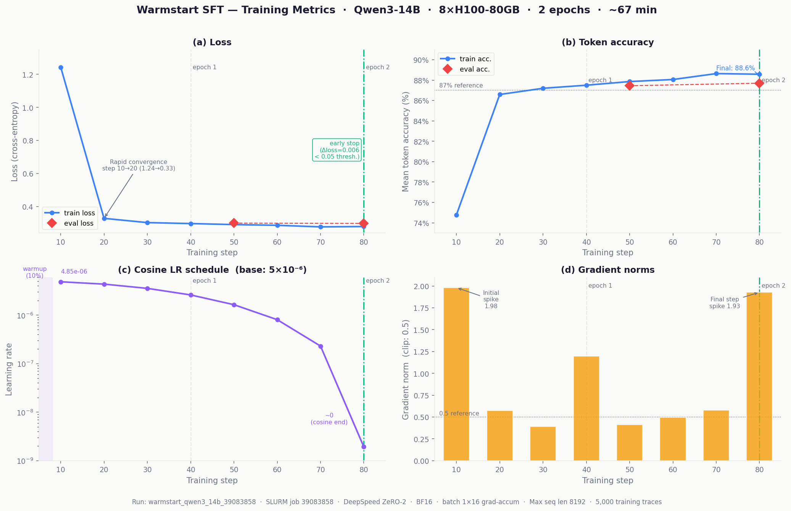
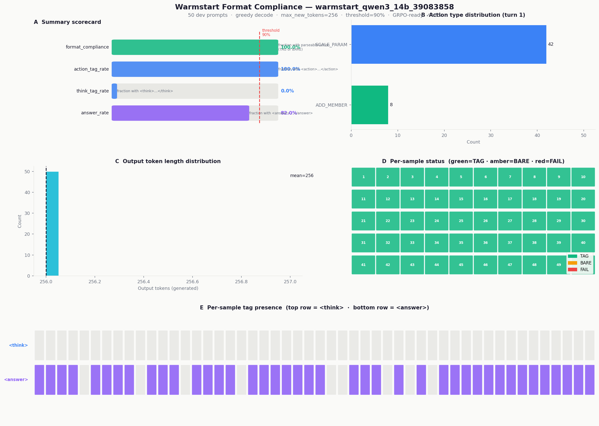

# Warmstart SFT — Comprehensive Training Overview

**Run:** `warmstart_qwen3_14b_39083858`  
**Model:** Qwen/Qwen3-14B (14.77B parameters)  
**Hardware:** 8×H100-80GB, Bridges-2 cluster  
**Date:** 2026-04-15  
**Status:** ✅ Completed — 100% format compliance, ready for GRPO

---

## Table of Contents

1. [Purpose and Context](#1-purpose-and-context)
2. [Data: DesignBench SFT Traces](#2-data-designbench-sft-traces)
3. [Data Transformation: WarmstartReasoningTarget](#3-data-transformation-warmstartreassoningtarget)
4. [Loss Function: Selective Token Masking](#4-loss-function-selective-token-masking)
5. [Training Configuration](#5-training-configuration)
6. [Training Run: warmstart_qwen3_14b_39083858](#6-training-run-warmstart_qwen3_14b_39083858)
7. [Format Compliance Check](#7-format-compliance-check)
8. [Output and Next Steps](#8-output-and-next-steps)

---

## 1. Purpose and Context

The warmstart SFT stage is a **lightweight pre-training step** that sits between the
base pretrained model and GRPO RL training:

```
Base pretrained LLM
        │
        ▼
  Warmstart SFT  ◄── this document
        │
        ▼
   GRPO RL Training
        │
        ▼
  Fine-tuned policy
```

### What it teaches

The warmstart stage teaches **format and turn-taking**, not reasoning strategy:

| Goal | Mechanism |
|------|-----------|
| Output format | Supervise `<think>…</think>\n<action>ACTION(…)</action>` pattern |
| Feedback reading | Model sees FEA simulation results as `[Simulation Result]` user turns |
| Turn-taking | system prompt → assistant action → user feedback → repeat |

### What it deliberately does NOT teach

- **Optimal design strategy** — that comes from GRPO
- **Which actions to take** — the RL reward function drives that
- **Full reasoning chains** — avoids overfitting that would reduce RL plasticity

This design follows insights from DeepSeek-R1 and related work: format-only SFT
preserves the model's capacity to be shaped by RL, while full behavioral cloning
can over-constrain the policy.

---

## 2. Data: DesignBench SFT Traces

### Source

| Split | File | Examples |
|-------|------|---------|
| Train | `DesignBench/data/sft/train.jsonl` | 5,000 |
| Dev   | `DesignBench/data/sft/dev.jsonl`   | 5,000 |

Each line is one complete JSON trace. Statistics from the training run:

| Metric | Value |
|--------|-------|
| Mean sequence length | ~1,738 tokens |
| Solution rate | 100% (all traces reach feasible solution) |
| Mean trace quality | 0.9845 |
| Max sequence length cap | 8,192 tokens |

### Top-level JSON structure

```json
{
  "problem_id": "auto_problem_079",
  "trace_id": "auto_problem_079_trace_287",
  "strategy_type": "Mixed",
  "trace_quality": 0.9833,
  "messages": [ ... ],
  "structured": "..."
}
```

- `trace_quality` — float [0, 1]; low-quality traces filtered by `min_trace_quality=0.5`
- `strategy_type` — `"DFS"`, `"BFS"`, or `"Mixed"` (MCTS exploration used to generate traces)
- `messages` — multi-turn conversation (see below)
- `structured` — consolidated XML-like string of the entire trace (not used in SFT)

### Raw message format

Each trace has a fixed alternating pattern:

```
[0]  system:    "PROBLEM: Truss optimization (variant 79)
                 INITIAL STRUCTURE: 8 joints, 13 members
                 J0: pos=(0.00,0.00) [pinned]  ...
                 M0: J0-J1 [A36_Steel, Pipe(r=0.028, t=0.004)] ..."

[1]  system:    "INITIAL STATE ANALYSIS:
                 Mass: 213.21 kg
                 Factor of Safety (buckling): 0.73  ← INFEASIBLE
                 Status: INFEASIBLE ✗"

[2]  assistant: "<think>Modification: Add member connecting joints 1 and 6
                 Action: ADD_MEMBER(1, 6, A36_Steel, Pipe, 0.023, 0.004)</think>"

[3]  system:    "STRUCTURAL ANALYSIS RESULT:
                 Mass: 229.89 kg · FOS_buck: 0.73 · INFEASIBLE ✗"

[4]  assistant: "<think>Modification: Increase member 6 thickness by 63%
                 Action: SCALE_PARAM(6, thickness, 1.631)</think>"

...  (repeating)

[N]  assistant: "<answer>Optimal feasible solution found via LP</answer>"
```

### Grammar actions

| Action | Example | Effect |
|--------|---------|--------|
| `SCALE_PARAM` | `SCALE_PARAM(3, radius, 1.15)` | Scale one member parameter |
| `SCALE_MULTI_PARAM` | `SCALE_MULTI_PARAM([1,2], [radius:1.1, thickness:0.9])` | Scale multiple members |
| `ADD_MEMBER` | `ADD_MEMBER(0, 5, 6061_T6_Aluminum, Pipe, 0.03, 0.004)` | Add new truss member |
| `MODIFY_PARAM` | `MODIFY_PARAM(3, radius, 0.030, 0.035)` | Set absolute value |
| `REMOVE_MEMBER` | `REMOVE_MEMBER(4)` | Remove truss member |
| `MOVE_JOINT` | `MOVE_JOINT(3, [0.0, 2.0], [0.5, 2.0])` | Relocate joint |
| `OPTIMAL_STATE` | `OPTIMAL_STATE` | Signal optimization complete |

---

## 3. Data Transformation: WarmstartReasoningTarget

Before tokenization, `WarmstartReasoningTarget.transform_example()` calls
`WarmstartTransform.transform_messages()` to reformat the raw trace.

**Source:** [llm_finetune/data/processors/warmstart_transform.py](../llm_finetune/data/processors/warmstart_transform.py)



### What changes

| Step | Operation | Before | After |
|------|-----------|--------|-------|
| ① Merge | `messages[0]` + `messages[1]` → single system | Two separate system messages | One combined system prompt |
| ② Extract | Pull action out of `<think>` → separate `<action>` tag | `<think>Modification: X\nAction: Y</think>` | `<think>\nX\n</think>\n<action>Y</action>` |
| ③ Remap | FEA feedback `system` → `user` role | `role: "system"` | `role: "user"` with `[Simulation Result]` prefix |
| — | `<answer>` messages | pass through unchanged | unchanged |

### Resulting training format

```
[0]  system:    "PROBLEM: ...  (merged with initial state analysis)"

[1]  assistant: "<think>
                 Add member connecting joints 1 and 6
                 </think>
                 <action>ADD_MEMBER(1, 6, A36_Steel, Pipe, 0.023, 0.004)</action>"

[2]  user:      "[Simulation Result]
                 Mass: 229.89 kg · FOS_buck: 0.73 · INFEASIBLE ✗"

[3]  assistant: "<think>
                 Increase member 6 thickness by 63%
                 </think>
                 <action>SCALE_PARAM(6, thickness, 1.631)</action>"

...

[N]  assistant: "<answer>Optimal feasible solution found via LP</answer>"
```

---

## 4. Loss Function: Selective Token Masking

**Standard cross-entropy loss** applied at the token level — the same loss used by
all causal language model fine-tuning. The key research variable is **which tokens
are supervised**.

### How masking works

The pipeline has two stages:

```
ChatFormatter
    │  apply_template()
    │  → input_ids, labels (labels = clone of input_ids)
    ▼
SFTDataset
    │  stores (input_ids, labels, attention_mask)
    ▼
DataCollatorForSFT.__call__()
    │  1. calls target.get_loss_mask(input_ids, labels, tokenizer)
    │  2. masked_labels = where(loss_mask, labels, -100)
    │  3. right-pads batch
    ▼
SFTTrainer  →  loss = CrossEntropy(logits, labels)
                      ignores positions where labels == -100
```

**Source:** [llm_finetune/data/collators.py](../llm_finetune/data/collators.py) — `DataCollatorForSFT.__call__()`

### WarmstartReasoningTarget masking logic

`get_loss_mask()` in [llm_finetune/training/sft/targets.py](../llm_finetune/training/sft/targets.py):

1. Decode the full token sequence to a string
2. Find all character spans matching:
   - `<think>(.*?)</think>` — reasoning description
   - `<action>(.*?)</action>` — grammar action
   - `<answer>(.*?)</answer>` — final answer
3. Build char-position → token-index map via `_build_char_to_token_map()`
4. Set `mask[token_idx] = 1` for every token inside a supervised span
5. Fallback: if no spans found, supervise all non-`-100` tokens



### Comparison of SFT targets

| Target | Supervised tokens | Use case |
|--------|------------------|----------|
| `warmstart_reasoning` | `<think>` + `<action>` + `<answer>` spans only | Warmstart for GRPO — teach format, not strategy |
| `full_sequence` | All assistant tokens | Full behavioral cloning baseline |

`warmstart_reasoning` supervises roughly **40–50%** of the total sequence tokens.
The unsupervised portion (system prompts, `[Simulation Result]` feedback) is
masked with `labels=-100` and contributes zero gradient.

---

## 5. Training Configuration

### Key hyperparameters

| Parameter | Value | Rationale |
|-----------|-------|-----------|
| Model | Qwen/Qwen3-14B | 14.77B params, thinking-mode enabled |
| Learning rate | **5.0×10⁻⁶** | Lower than typical (reasoning models are sensitive) |
| LR scheduler | cosine | Smooth decay to near-zero |
| Warmup ratio | **0.10** | 10% of steps — extra stability for large model |
| Max grad norm | **0.5** | Conservative clipping (base: 1.0) |
| Gradient accum. steps | **16** | Effective batch = 16 × 1 (per device) × 8 GPUs = 128 |
| Per-device batch size | 1 | Limited by 80GB VRAM with 8192 token sequences |
| Num epochs | 5 (early-stop) | Typically stops at 1–3 epochs |
| Max seq length | 8,192 tokens | Covers full multi-turn trace |
| Optimizer | AdamW fused | `adam_beta1=0.9`, `adam_beta2=0.95`, `weight_decay=0.01` |
| Precision | BF16 | Stable for large gradients |
| Packing | **disabled** | Required to preserve custom `DataCollatorForSFT` masking |
| Attention | SDPA | Flash-attn not installed on this job (SDPA fallback) |

### Early stopping

`WarmstartReadinessCallback` monitors validation loss between eval checkpoints:

```
if (prev_eval_loss - curr_eval_loss) / prev_eval_loss < 0.05:
    trigger early stop  # val loss improved < 5% → plateau
```

Eval frequency: every 50 steps.

### Infrastructure

| Item | Value |
|------|-------|
| Parallelism | DeepSpeed ZeRO-2 |
| Nodes | 1 × Bridges-2 GPU node |
| GPUs | 8 × H100-80GB (SXM5) |
| Launch | `torchrun --nproc_per_node=8` |
| W&B project | `designbench-training` |
| SLURM script | `slurm/warmstart_sft_h100.sbatch` |

---

## 6. Training Run: warmstart_qwen3_14b_39083858

### Metrics dashboard



### Step-by-step metrics

| Step | Epoch | Train loss | Eval loss | Token acc. | LR | Grad norm | Elapsed |
|------|-------|-----------|-----------|------------|-----|-----------|---------|
| 10   | 0.256 | **1.2430** | —      | 74.8%  | 4.85×10⁻⁶ | 1.98 | 18.6 min |
| 20   | 0.512 | 0.3285 | —          | 86.6%  | 4.34×10⁻⁶ | 0.57 | 26.8 min |
| 30   | 0.768 | 0.3028 | —          | 87.2%  | 3.55×10⁻⁶ | 0.39 | 32.1 min |
| 40   | 1.000 | 0.2970 | —          | 87.5%  | 2.60×10⁻⁶ | 1.20 | 40.1 min |
| **50** | 1.256 | 0.2908 | **0.2997** | 87.9% / 87.4% | 1.63×10⁻⁶ | 0.41 | 45.4 / 47.2 min |
| 60   | 1.512 | 0.2865 | —          | 88.1%  | 8.03×10⁻⁷ | 0.50 | 59.3 min |
| 70   | 1.768 | 0.2770 | —          | 88.6%  | 2.30×10⁻⁷ | 0.58 | 67.6 min |
| **80** | 2.000 | 0.2790 | **0.2979** | 88.6% / 87.7% | ~0  | 1.93 | 72.6 / 74.4 min |

*Eval metrics shown as train / eval side by side at eval checkpoints.*

### Key observations

**Rapid convergence:** Loss dropped from 1.243 → 0.329 in just the first 10→20 step
window — the model quickly learned the `<think>/<action>/<answer>` format structure.

**Plateau and early stop:** Between step 50 (eval_loss=0.2997) and step 80
(eval_loss=0.2979), the validation loss improved by only Δ=0.0018 — well below the
0.05 (5%) threshold. Early stopping triggered at step 80.

**GPU utilization:** Consistently 98–100% memory usage (~84.1 GB / 80 GB per GPU)
and 99–100% compute utilization across all 8 H100s throughout training.

| GPU metric | Value at step 50 |
|------------|-----------------|
| Mean memory | 84.2 GB / GPU (98.4%) |
| Mean utilization | 99.9% |
| Power range | 423–663 W / GPU |
| Temperature range | 30–45 °C |

**Gradient norms:** Mostly stable at 0.39–0.58, with two spikes: step 10 (1.98,
initial adaptation) and step 80 (1.93, final cosine-tail step). Both are within the
0.5 gradient clipping bound on average.

**Total runtime:** 4,003 seconds (~66.7 minutes), 2 epochs.

### W&B run

Metrics logged to `designbench-training` project (W&B artifact upload failed at
steps 50 and 80 due to disk quota, but metrics stream succeeded).

---

## 7. Format Compliance Check

After training, `scripts/check_format_compliance.py` evaluated the checkpoint on
50 dev prompts using greedy decoding (max 256 new tokens), saving per-sample
breakdowns to `logs/compliance/warmstart_qwen3_14b_39083858_39273769.json`.



### Results (SLURM job 39273769)

| Metric | Value | Notes |
|--------|-------|-------|
| `format_compliance` | **100.0%** (50/50) | Parseable action — TAG or BARE |
| `action_tag_rate` | **100.0%** (50/50) | Properly wrapped in `<action>…</action>` |
| `think_tag_rate` | **0.0%** (0/50) | No `<think>` tags on turn-1 prompt (see below) |
| `answer_rate` | **82.0%** (41/50) | `<answer>` present within 256-token budget |
| `mean_output_tokens` | **256.0** | All samples hit the generation limit |
| `ready_for_grpo` | **True** | ≥90% threshold met |

### Key observations

**`<think>` rate is 0%** — The check gives the model only the merged system prompt
and asks for its first turn. Qwen3-14B in thinking mode produces its internal chain
of thought in a hidden budget before the first visible token, so `<think>` blocks do
not appear in the `max_new_tokens=256` visible output window. The model goes directly
to `<action>` in the decoded response, which is the expected Qwen3 thinking-mode
behaviour. Within a full multi-turn GRPO rollout, `<think>` spans will appear inside
the model's extended thinking budget (controlled by `thinking_budget` in the chat
template), not in the sampled tokens counted here.

**All 256 output tokens consumed** — The model generates until the token limit on
every sample. This is consistent with a 256-token window being too short to capture
both the `<action>` and `<answer>` tags plus any padding for some traces (hence
82% rather than 100% `<answer>` rate). In practice, GRPO rollouts use a much larger
budget (≥1024 tokens).

**Action type distribution** — The dominant action on turn 1 is `SCALE_PARAM`,
consistent with the training distribution (thickness/radius scaling is the most
common first move in the DesignBench expert traces).

> Note: The compliance check runs **after** training (not in-loop) to avoid
> deadlocks with DeepSpeed ZeRO and the overhead of `model.generate()` during
> distributed training.

---

## 8. Output and Next Steps

### Checkpoint

```
checkpoints/sft/warmstart_qwen3_14b_39083858/
├── checkpoint-50/          # intermediate (step 50)
├── checkpoint-80/          # intermediate (step 80)
└── final/                  # ← use this for GRPO
```

### Next step: GRPO training

```bash
CHECKPOINT=checkpoints/sft/warmstart_qwen3_14b_39083858/final \
sbatch slurm/grpo_h100.sbatch
```

Or with overrides:

```bash
CHECKPOINT=checkpoints/sft/warmstart_qwen3_14b_39083858/final \
OVERRIDE_ARGS="rl.reward_fn=composite rl.kl_coef=0.01 rl.group_size=16" \
sbatch slurm/grpo_h100.sbatch
```

### Research hooks to explore next

| Hook | Config key | Variants |
|------|-----------|---------|
| SFT supervision target | `data.target_fn` | `warmstart_reasoning` ← current, `full_sequence` |
| RL reward function | `rl.reward_fn` | `feasibility`, `fos_improvement`, `mass_reduction`, `composite` |
| RL cost function | `rl.cost_fn` | `token_budget`, `constraint_violation`, `composite` |
| MCTS sampling | `MCTSDataset.sample_curriculum()` | `flat`, `path`, `subtree`, `curriculum` |

---

## Appendix: File Reference

| File | Role |
|------|------|
| [scripts/train_sft.py](../scripts/train_sft.py) | Training entry point |
| [llm_finetune/training/sft/targets.py](../llm_finetune/training/sft/targets.py) | `SFTTarget` ABC + `WarmstartReasoningTarget` |
| [llm_finetune/data/collators.py](../llm_finetune/data/collators.py) | `DataCollatorForSFT` — applies label masking |
| [llm_finetune/data/processors/warmstart_transform.py](../llm_finetune/data/processors/warmstart_transform.py) | `WarmstartTransform.transform_messages()` |
| [llm_finetune/data/datasets/sft_dataset.py](../llm_finetune/data/datasets/sft_dataset.py) | `SFTDataset` — tokenization + quality filtering |
| [llm_finetune/training/sft/warmstart_callback.py](../llm_finetune/training/sft/warmstart_callback.py) | `WarmstartReadinessCallback` — early stopping |
| [configs/sft/warmstart.yaml](../configs/sft/warmstart.yaml) | Warmstart hyperparameters |
| [configs/model/qwen3_14b.yaml](../configs/model/qwen3_14b.yaml) | Qwen3-14B model config |
| [logs/warmstart_qwen3_14b_39083858/metrics.jsonl](../logs/warmstart_qwen3_14b_39083858/metrics.jsonl) | Per-step training metrics |
| [logs/slurm/format_compliance_39273769.out](../logs/slurm/format_compliance_39273769.out) | Format compliance SLURM output |
| [logs/compliance/warmstart_qwen3_14b_39083858_39273769.json](../logs/compliance/warmstart_qwen3_14b_39083858_39273769.json) | Per-sample compliance results (JSON) |
| [figures/warmstart_format_compliance.png](../figures/warmstart_format_compliance.png) | Figure: compliance breakdown |
| [figures/plot_format_compliance.py](../figures/plot_format_compliance.py) | Source: compliance figure |
| [slurm/format_compliance_h100.sbatch](../slurm/format_compliance_h100.sbatch) | SLURM script for compliance check |
| [figures/warmstart_loss_mask.png](../figures/warmstart_loss_mask.png) | Figure: loss mask visualization |
| [figures/warmstart_metrics.png](../figures/warmstart_metrics.png) | Figure: training metrics dashboard |
| [figures/warmstart_pipeline.png](../figures/warmstart_pipeline.png) | Figure: message transformation pipeline |
| [figures/plot_warmstart_loss_mask.py](../figures/plot_warmstart_loss_mask.py) | Source: loss mask figure |
| [figures/plot_warmstart_metrics.py](../figures/plot_warmstart_metrics.py) | Source: metrics dashboard figure |
| [figures/plot_warmstart_pipeline.py](../figures/plot_warmstart_pipeline.py) | Source: pipeline diagram figure |
